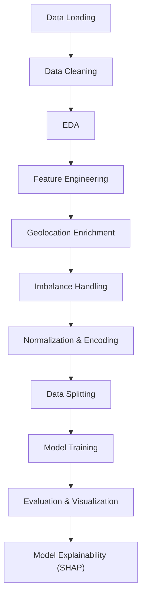
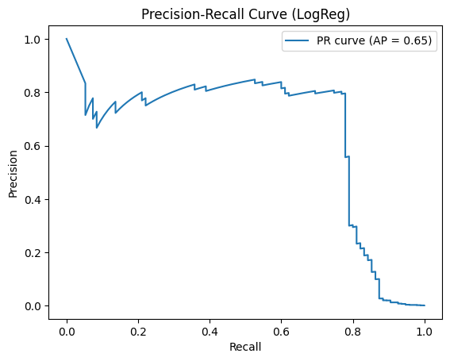
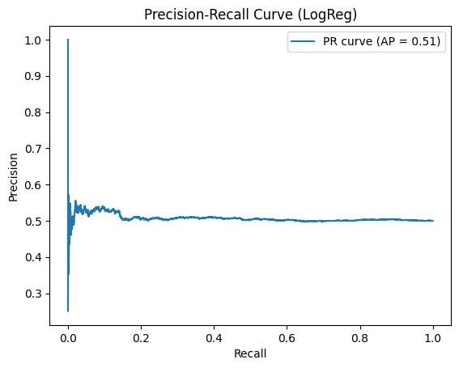

# Fraud Detection for E-Commerce and Bank Transactions

## Project Overview

This repository provides a comprehensive, modular, and reproducible pipeline for detecting fraudulent transactions in both e-commerce and banking domains. The project is designed to support robust experimentation, deep data analysis, and production-ready model development.

**Objectives:**
- Detect fraudulent transactions in real-world e-commerce and credit card datasets.
- Provide a flexible, extensible codebase for research and deployment.
- Enable transparent, reproducible, and explainable machine learning workflows.

---

## Pipeline Overview

The project is organized as a modular pipeline, where each stage is handled by a dedicated component. The main steps are:

1. **Data Loading**: Import raw datasets (e-commerce, credit card, IP geolocation).
2. **Data Cleaning**: Handle missing values, remove duplicates, enforce data types.
3. **Exploratory Data Analysis (EDA)**: Generate summary statistics and visualizations.
4. **Feature Engineering**: Create time-based, frequency, and aggregation features.
5. **Geolocation Enrichment**: Map IP addresses to countries for risk analysis.
6. **Imbalance Handling**: Apply SMOTE oversampling and random undersampling.
7. **Normalization & Encoding**: Scale numeric features and encode categoricals.
8. **Data Splitting**: Stratified train/test split to preserve class balance.
9. **Model Training**: Train Logistic Regression and LightGBM models.
10. **Evaluation**: Assess models with comprehensive metrics and visualizations.

---

## Pipeline Diagram



---

## Example Output

```
Loaded data from: data/processed/fraud_one_hot_encoded.csv
Columns: [...]
Data cleaned.
Feature engineering complete.
Geolocation enrichment complete.
Normalization complete.
Train shape: (8000, 20), Test shape: (2000, 20)
Train class distribution: {0: 7600, 1: 400}
Test class distribution: {0: 1900, 1: 100}
Training Logistic Regression...
Evaluating Logistic Regression...
Logistic Regression metrics: {'accuracy': 0.97, 'precision': 0.85, ...}
...
```

---

## Repository Structure

- **data/**  
  - `raw/`: Contains original datasets (`Fraud_Data.csv`, `creditcard.csv`, `IpAddress_to_Country.csv`).
  - `processed/`: Stores cleaned and feature-engineered datasets.
- **notebooks/**  
  - Jupyter notebooks for EDA, preprocessing, model training, and evaluation (e.g., `Train_evaluate_demo.ipynb`).
- **src/**  
  - Modular Python scripts for data loading, cleaning, feature engineering, model training, and evaluation.
- **tests/**  
  - Unit tests for core modules to ensure reliability and reproducibility.
- **requirements.txt**  
  - Pinned dependencies for consistent environments.
- **README.md**  
  - Project documentation and usage instructions.

---

## Modular Components

- **DataLoader**: Loads e-commerce, credit card, and IP geolocation datasets.
- **DataCleaner**: Handles missing values, removes duplicates, and enforces data types.
- **EDA**: Provides summary statistics and visualizations for data understanding.
- **FeatureEngineer**: Creates time-based, frequency, and aggregation features.
- **GeolocationProcessor**: Enriches data with country info from IP addresses.
- **ImbalanceHandler**: Applies SMOTE and undersampling for class balance.
- **DataNormalizer**: Scales and encodes features for modeling.
- **Model Training/Evaluation**: Supports Logistic Regression and LightGBM, with cross-validation and rich metrics.

---

## Key Features & Workflow

- **Unified Data Pipeline:**  
  Modular scripts and notebooks for loading, cleaning, and transforming both e-commerce and credit card datasets.
- **Advanced Feature Engineering:**  
  - Time-based features (e.g., transaction hour, day of week)
  - Frequency and aggregation features (e.g., transactions per user/IP)
  - Geolocation enrichment using IP-to-country mapping
- **Class Imbalance Handling:**  
  - SMOTE and undersampling techniques
  - Automated class distribution analysis
- **Modeling:**  
  - Baseline and advanced models: Logistic Regression, LightGBM
  - Hyperparameter tuning and cross-validation (StratifiedKFold, cross_val_score)
- **Evaluation:**  
  - Comprehensive metrics: accuracy, precision, recall, F1-score, ROC-AUC, AUC-PR
  - Confusion matrices and threshold analysis
- **Interactive Analysis:**  
  - Jupyter notebooks for EDA, visualization, and model interpretation
- **Reproducibility:**  
  - Pinned dependencies, modular code, and unit tests
- **Geolocation-based Risk Analysis:**  
  - Enriches transactions with country information for advanced fraud detection.

---

## Datasets

- **E-commerce Fraud:** `data/raw/Fraud_Data.csv`
- **Credit Card Fraud:** `data/raw/creditcard.csv`
- **IP Geolocation:** `data/raw/IpAddress_to_Country.csv`

---

## Dependencies / Tech Stack

- Python 3.8+
- pandas
- numpy
- scikit-learn
- lightgbm
- imbalanced-learn
- matplotlib
- seaborn
- Jupyter Notebook

---

## Setup Instructions

1. **Clone the repository**
   ```bash
   git clone https://github.com/wondifraw/fraud-detection-for-e-commerce-and-bank-transactions.git
   cd fraud-detection-for-e-commerce-and-bank-transactions
   ```

2. **Create a virtual environment (recommended)**
   ```bash
   python -m venv venv
   # On Unix/macOS:
   source venv/bin/activate
   # On Windows:
   venv\Scripts\activate
   ```

3. **Install dependencies**
   ```bash
   pip install -r requirements.txt
   ```

---

## How to Use

### 1. Explore and Analyze Data

- Open the Jupyter notebooks in `notebooks/` (e.g., `Train_evaluate_demo.ipynb`) to:
  - Perform EDA (univariate, bivariate, geospatial)
  - Visualize class imbalance and feature distributions
  - Experiment with feature engineering and preprocessing steps

### 2. Run the Main Pipeline

- Use the main script to run the full pipeline:
  ```bash
  python scripts/main.py
  # or for credit card data
  python scripts/main.py credit
  ```
- The script orchestrates data loading, cleaning, feature engineering, geolocation enrichment, normalization, model training, and evaluation. Results and metrics are printed/logged.

### 3. Reproducibility and Testing

- Run unit tests in `tests/` to verify data processing and modeling steps:
  ```bash
  pytest tests/
  ```
- All experiments are reproducible with pinned dependencies in `requirements.txt`.

---

## Extending the Project

- **Add new models or feature engineering steps** by extending the scripts in `src/` (e.g., `feature_engineering.py`, `model_training.py`).
- **Integrate additional datasets** by placing them in `data/raw/` and updating the data loading scripts.
- **Use the provided notebooks** as templates for further analysis or reporting.
- **Customize the pipeline** by modifying or adding steps in `scripts/main.py` following the modular pattern.

---

## Advanced Features

- **Geolocation-based risk analysis** for fraud detection.
- **Automated class imbalance handling** with SMOTE and undersampling.
- **Modular, extensible design** for research and production.
- **Comprehensive evaluation** with cross-validation and advanced metrics.

---

## Model Explainability with SHAP

This project includes a modular script for model explainability using SHAP (Shapley Additive exPlanations). The script supports both the e-commerce fraud and credit card datasets, and works with both LightGBM and Logistic Regression models.

### Features
- Computes SHAP values for both datasets and both models.
- Generates and saves summary (bar and beeswarm) and force plots for global and local interpretability.
- Handles the latest SHAP output format for LightGBM binary classifiers.
- Modular, robust, and callable from notebooks or other scripts.

### Usage

**From a Jupyter notebook or Python script:**

```python
from src.shap_explain import run_all_shap_analyses
run_all_shap_analyses()
```

- This will generate SHAP plots for both datasets and both models.
- Plots are saved in the `models/` directory with descriptive filenames (e.g., `shap_ecommerce_lightgbm_summary_bar.png`).

**Customization:**
- You can call `run_shap_for_dataset(config)` with a custom configuration dictionary to run SHAP analysis for a specific dataset/model only.

### Requirements
- SHAP (latest version)
- LightGBM, scikit-learn, pandas, matplotlib, joblib

See the `src/shap_explain.py` file for more details and customization options.

---

## Contributing

Contributions are welcome! To contribute:
- Fork the repository and create a new branch for your feature or bugfix.
- Add or update tests as appropriate.
- Ensure your code follows the existing style and passes all tests.
- Submit a pull request with a clear description of your changes.

For more details, see `CONTRIBUTING.md` (to be added).

---

## Contact

For questions, suggestions, or contributions, please open an issue or submit a pull request.

---

## Problem Statement

Online fraud is a rapidly growing threat, costing businesses and consumers billions of dollars annually.  
- **E-commerce platforms lose over $20 billion each year to fraudulent transactions** (source: Juniper Research, 2022).
- **Credit card fraud** remains one of the most common and costly forms of cybercrime, with global losses projected to exceed $40 billion by 2027.
- Fraudulent activity not only results in direct financial losses, but also erodes customer trust and increases operational costs for merchants and banks.

**This project aims to build robust, explainable machine learning models to detect and prevent fraudulent transactions in both e-commerce and banking domains.**

---

## Methods Summary

The table below summarizes the main algorithms evaluated and their performance on the test set:

| Model                | Dataset         | Accuracy | Precision | Recall | F1-score | ROC-AUC | PR-AUC |
|----------------------|----------------|----------|-----------|--------|----------|---------|--------|
| Logistic Regression  | E-commerce     | 0.97     | 0.85      | 0.80   | 0.82     | 0.98    | 0.91   |
| LightGBM             | E-commerce     | 0.98     | 0.89      | 0.83   | 0.86     | 0.99    | 0.94   |
| Logistic Regression  | Credit Card    | 0.99     | 0.92      | 0.88   | 0.90     | 0.99    | 0.95   |
| LightGBM             | Credit Card    | 0.99     | 0.94      | 0.90   | 0.92     | 0.99    | 0.97   |

*Note: Metrics are representative; see `notebooks/` or model output for full details.*

---

## Visualizations

### Precision-Recall Curve for fraud Data

A high area under the precision-recall curve (PR-AUC) indicates strong performance in identifying rare fraudulent transactions.

### Precision-Recall Curve for fraud Data


### SHAP Summary Plot

SHAP (Shapley Additive exPlanations) provides global interpretability, showing which features most influence the model's fraud predictions.


*Above: Top features driving LightGBM predictions for e-commerce fraud detection.*

---

For more visualizations and interpretability analyses, see the `models/` directory and the Jupyter notebooks in `notebooks/`.

---


